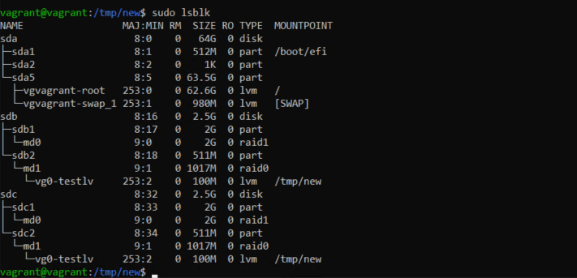

# Могут ли файлы, являющиеся жесткой ссылкой на один объект, иметь разные права доступа и владельца? Почему?
Файлы являющиеся жёсткой ссылкой не могут иметь разные права доступа, т.к. они имеют тот же inode и набор прав (разрешений), что и оригинальный файл. Разрешения на ссылку меняются при изменении разрешений исходного файла.
# Используя fdisk, разбейте первый диск на 2 раздела: 2 Гб, оставшееся пространство.
sudo fdisk -l  
sudo fdisk /dev/sdb  
g  
n  
1  
+2G  
w  
sudo fdisk /dev/sdb  
n  
2  
p  
w  
sudo fdisk -l  
# Используя sfdisk, перенесите данную таблицу разделов на второй диск.
sudo sfdisk -d /dev/sdb > part_table  
sudo sfdisk /dev/sdc < part_table  
# Соберите mdadm RAID1 на паре разделов 2 Гб.
sudo mdadm --create --verbose /dev/md0 -l 1 -n 2 /dev/sd{b1,c1}  
# Соберите mdadm RAID0 на второй паре маленьких разделов.
sudo mdadm --create --verbose /dev/md1 -l 0 -n 2 /dev/sd{b2,c2}  
# Создайте 2 независимых PV на получившихся md-устройствах.
sudo pvcreate /dev/md0 /dev/md1  
# Создайте общую volume-group на этих двух PV.
sudo vgcreate vg0 /dev/md0 /dev/md1  
# Создайте LV размером 100 Мб, указав его расположение на PV с RAID0.
sudo lvcreate -L 100 -ntestlv vg0 /dev/md1  
# Создайте mkfs.ext4 ФС на получившемся LV.
sudo mkfs.ext4 /dev/vg0/testlv  
# Смонтируйте этот раздел в любую директорию, например, /tmp/new.
sudo mkdir /tmp/new  
sudo mount /dev/vg0/testlv /tmp/new  
# Вывод lsblk

# Используя pvmove, переместите содержимое PV с RAID0 на RAID1.
sudo pvmove /dev/md1 /dev/md0  
# Сделайте --fail на устройство в вашем RAID1 md.
sudo mdadm /dev/md0 -f /dev/sdb1  
# Подтвердите выводом dmesg, что RAID1 работает в деградированном состоянии.
[78370.881812] EXT4-fs (dm-2): mounted filesystem with ordered data mode. Opts: (null)  
[78370.881819] ext4 filesystem being mounted at /tmp/new supports timestamps until 2038 (0x7fffffff)  
[83614.870324] md/raid1:md0: Disk failure on sdb1, disabling device.  
               md/raid1:md0: Operation continuing on 1 devices.  
# Протестируйте целостность файла, несмотря на "сбойный" диск он должен продолжать быть доступен:
vagrant@vagrant:/tmp/new$ gzip -t /tmp/new/test.gz  
vagrant@vagrant:/tmp/new$ echo $?  
0  
