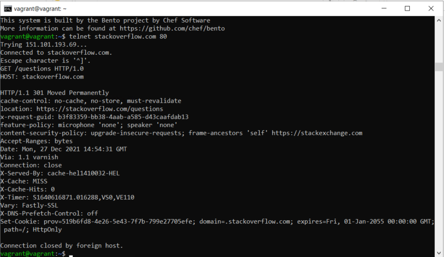
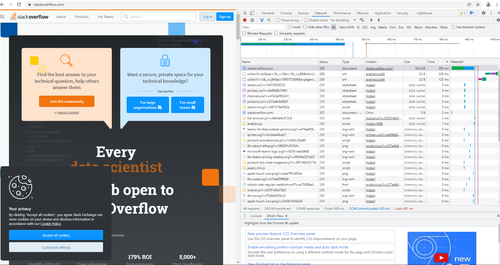
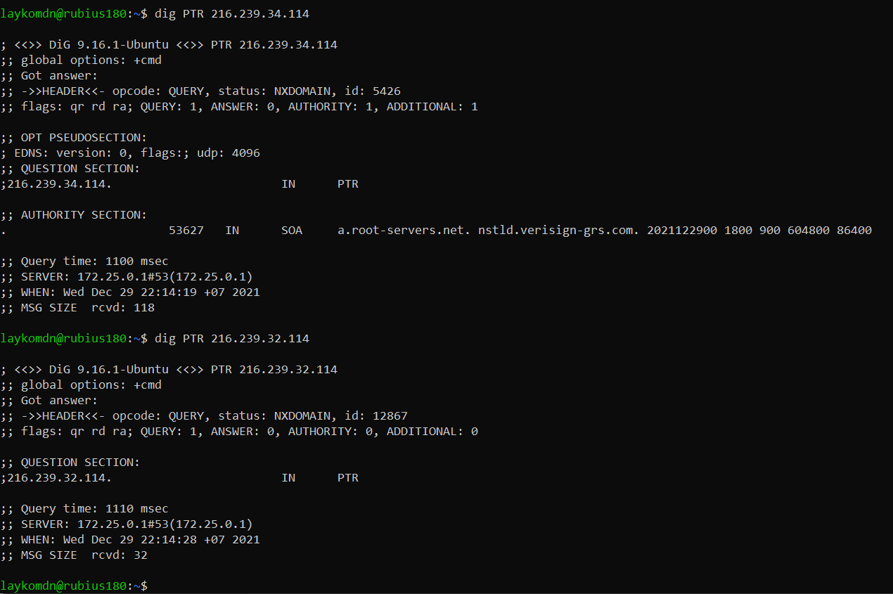

# Работа c HTTP через телнет.

Сервер вернул ответ с кодом 301. Этот код означает что страница была перемещана на новый адрес и браузеру необходимо перезапрасить страницу по новому адресу. В данном случае через использование http кода 301 сделано перенаправление на защищённую версию сайта по протоколу SSL/TLS (https, порт 443/TCP).  
# Повторите задание 1 в браузере, используя консоль разработчика F12.
Status Code: 307 Internal Redirect  
Дольше всех обрабатывался запрос к Request URL: https://stackoverflow.com/ 395.73ms  

# Какой IP адрес у вас в интернете?
dig +short myip.opendns.com @resolver1.opendns.com  
109.194.34.184  
# Какому провайдеру принадлежит ваш IP адрес? Какой автономной системе AS?
Информация о провайдере:  
route:          109.194.34.0/23  
origin:         AS56981  
org:            ORG-CHTB3-RIPE  
descr:          CJSC "ER-Telecom Holding" Tomsk branch  
descr:          Tomsk, Russia  
mnt-by:         RAID-MNT  
created:        2011-06-28T09:27:06Z  
last-modified:  2011-06-28T09:27:15Z  
source:         RIPE # Filtered  
Информация об автономной системе:  
vagrant@vagrant:~$ whois 109.194.34.184 | grep origin  
origin:         AS56981  
# Через какие сети проходит пакет, отправленный с вашего компьютера на адрес 8.8.8.8? Через какие AS? Воспользуйтесь утилитой traceroute
Сети:
administrator@server-ares:~$ traceroute 8.8.8.8   
traceroute to 8.8.8.8 (8.8.8.8), 30 hops max, 60 byte packets  
 1  _gateway (192.168.0.1)  0.365 ms  0.337 ms  0.318 ms  
 2  172.16.1.1 (172.16.1.1)  0.794 ms  0.794 ms  0.778 ms  
 3  * * *  
 4  dynamicip-109-194-40-139.pppoe.tomsk.ertelecom.ru (109.194.40.139)  1.466 ms  1.462 ms  1.447 ms  
 5  72.14.215.165 (72.14.215.165)  41.589 ms  41.321 ms  41.319 ms  
 6  72.14.215.166 (72.14.215.166)  41.802 ms  41.795 ms  41.773 ms  
 7  * * *  
 8  108.170.250.33 (108.170.250.33)  43.119 ms 108.170.250.129 (108.170.250.129)  49.898 ms 108.170.227.74 (108.170.227.74)  48.909 ms  
 9  108.170.250.99 (108.170.250.99)  51.303 ms * 108.170.250.83 (108.170.250.83)  105.282 ms  
10  209.85.255.136 (209.85.255.136)  57.023 ms  56.942 ms *  
11  216.239.48.224 (216.239.48.224)  56.359 ms 172.253.65.82 (172.253.65.82)  56.127 ms  53.581 ms  
12  216.239.63.27 (216.239.63.27)  57.024 ms 72.14.237.199 (72.14.237.199)  54.989 ms 216.239.49.115 (216.239.49.115)  57.994 ms  
13  * * *  
14  * * *  
15  * * *  
16  * * *  
17  * * *  
18  * * *  
19  * * *  
20  * * *  
21  * * *  
22  * * *  
23  * * *  
24  * * *  
25  * * *  
26  * * *  
27  * * *  
28  * * *  
29  * * *  
30  * * *  

Автономные системы
AS56981  
AS15169  
Номеров других AS нет в ответах whois  
# Повторите задание 5 в утилите mtr. На каком участке наибольшая задержка - delay?
vagrant@vagrant:~$ mtr -n -r -c 100 8.8.8.8  
Start: 2021-12-29T14:33:24+0000  
HOST: vagrant                     Loss%   Snt   Last   Avg  Best  Wrst StDev  
  1.|-- 10.0.2.2                   0.0%   100    0.3   0.3   0.3   0.5   0.0  
  2.|-- 192.168.50.1               0.0%   100    0.8   0.8   0.6   3.6   0.3  
  3.|-- 172.16.1.1                99.0%   100    1.4   1.4   1.4   1.4   0.0  
  4.|-- 188.235.125.253            0.0%   100    1.4   1.5   1.2   2.8   0.3  
  5.|-- 109.194.40.139             0.0%   100    1.7   2.5   1.4  27.0   3.2  
  6.|-- 72.14.215.165              0.0%   100   42.8  43.9  41.1  75.0   5.9  
  7.|-- 72.14.215.166              9.0%   100   42.0  42.3  41.5  45.1   0.7  
  8.|-- 142.251.53.69              2.0%   100   42.2  42.5  42.0  45.4   0.6  
  9.|-- 108.170.250.113           15.0%   100   54.2  53.3  50.7  82.6   6.5  
 10.|-- 142.251.49.158            61.0%   100   55.1  56.2  54.5  80.7   4.3  
 11.|-- 74.125.253.94              2.0%   100   58.2  57.2  54.4 107.6   7.0  
 12.|-- 216.239.49.115             2.0%   100   56.5  56.9  56.2  62.1   0.8  
 13.|-- ???                       100.0   100    0.0   0.0   0.0   0.0   0.0  
 14.|-- ???                       100.0   100    0.0   0.0   0.0   0.0   0.0  
 15.|-- ???                       100.0   100    0.0   0.0   0.0   0.0   0.0  
 16.|-- ???                       100.0   100    0.0   0.0   0.0   0.0   0.0  
 17.|-- ???                       100.0   100    0.0   0.0   0.0   0.0   0.0  
 18.|-- ???                       100.0   100    0.0   0.0   0.0   0.0   0.0  
 19.|-- ???                       100.0   100    0.0   0.0   0.0   0.0   0.0  
 20.|-- ???                       100.0   100    0.0   0.0   0.0   0.0   0.0  
 21.|-- ???                       100.0   100    0.0   0.0   0.0   0.0   0.0  
 22.|-- 8.8.8.8                   32.0%   100   54.5  55.0  54.4  62.9   1.3  

Самая большая задержка на шаге 11  
# Какие DNS сервера отвечают за доменное имя dns.google? Какие A записи? воспользуйтесь утилитой dig
vagrant@vagrant:~$ dig NS dns.google

; <<>> DiG 9.16.1-Ubuntu <<>> NS dns.google
;dns.google.                    IN      NS

;; ANSWER SECTION:
dns.google.             20005   IN      NS      ns1.zdns.google.
dns.google.             20005   IN      NS      ns2.zdns.google.
dns.google.             20005   IN      NS      ns3.zdns.google.
dns.google.             20005   IN      NS      ns4.zdns.google.
ns4.zdns.google.        0       IN      A       216.239.38.114  
ns4.zdns.google.        0       IN      AAAA    2001:4860:4802:38::72  
ns3.zdns.google.        0       IN      A       216.239.36.114  
ns3.zdns.google.        0       IN      AAAA    2001:4860:4802:36::72  
ns2.zdns.google.        0       IN      A       216.239.34.114  
ns2.zdns.google.        0       IN      AAAA    2001:4860:4802:34::72  
ns1.zdns.google.        0       IN      A       216.239.32.114  
ns1.zdns.google.        0       IN      AAAA    2001:4860:4802:32::72  

# Проверьте PTR записи для IP адресов из задания 7. Какое доменное имя привязано к IP? воспользуйтесь утилитой dig
Доменное имя a.root-servers.net. nstld.verisign-grs.com.

