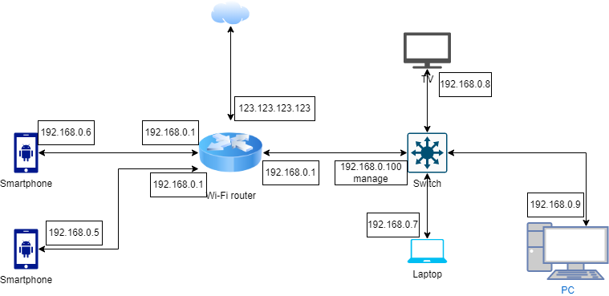

# Подключитесь к публичному маршрутизатору в интернет. Найдите маршрут к вашему публичному IP
```
route-views>show ip route 109.194.34.184
Routing entry for 109.194.32.0/20
  Known via "bgp 6447", distance 20, metric 0
  Tag 6939, type external
  Last update from 64.71.137.241 3w1d ago
  Routing Descriptor Blocks:
  * 64.71.137.241, from 64.71.137.241, 3w1d ago
      Route metric is 0, traffic share count is 1
      AS Hops 3
      Route tag 6939
      MPLS label: none
```
```
route-viewa>show bgp 109.194.34.184
BGP routing table entry for 109.194.32.0/20, version 1417203593
Paths: (23 available, best #22, table default)
  Not advertised to any peer
  Refresh Epoch 1
  53767 174 174 1299 9049 9049 56981
    162.251.163.2 from 162.251.163.2 (162.251.162.3)
      Origin incomplete, localpref 100, valid, external
      Community: 174:21000 174:22013 53767:5000
      path 7FE02CFBABE0 RPKI State not found
      rx pathid: 0, tx pathid: 0
  Refresh Epoch 1
  3333 9002 9049 56981
    193.0.0.56 from 193.0.0.56 (193.0.0.56)
      Origin IGP, localpref 100, valid, external
      path 7FE14A43F0D8 RPKI State not found
      rx pathid: 0, tx pathid: 0
  Refresh Epoch 1
  1351 6939 9049 56981
    132.198.255.253 from 132.198.255.253 (132.198.255.253)
      Origin IGP, localpref 100, valid, external
      path 7FE0FA35F480 RPKI State not found
      rx pathid: 0, tx pathid: 0
  Refresh Epoch 1
  20912 3257 9002 9049 56981
    212.66.96.126 from 212.66.96.126 (212.66.96.126)
      Origin IGP, localpref 100, valid, external
      Community: 3257:8052 3257:50001 3257:54900 3257:54901 20912:65004 65535:65284
      path 7FE0DB8733B0 RPKI State not found
      rx pathid: 0, tx pathid: 0
  Refresh Epoch 2
  8283 1299 9049 9049 56981
    94.142.247.3 from 94.142.247.3 (94.142.247.3)
      Origin incomplete, metric 0, localpref 100, valid, external
      Community: 1299:30000 8283:1 8283:101
      unknown transitive attribute: flag 0xE0 type 0x20 length 0x18
        value 0000 205B 0000 0000 0000 0001 0000 205B
              0000 0005 0000 0001
      path 7FE036478A48 RPKI State not found
      rx pathid: 0, tx pathid: 0
  Refresh Epoch 3
  3303 6939 9049 56981
    217.192.89.50 from 217.192.89.50 (138.187.128.158)
      Origin IGP, localpref 100, valid, external
      Community: 3303:1006 3303:1021 3303:1030 3303:3067 6939:7040 6939:8752 6939:9002
      path 7FE14308AF10 RPKI State not found
      rx pathid: 0, tx pathid: 0
  Refresh Epoch 1
  3549 3356 9002 9002 9002 9002 9002 9049 56981
    208.51.134.254 from 208.51.134.254 (67.16.168.191)
      Origin IGP, metric 0, localpref 100, valid, external
      Community: 3356:2 3356:22 3356:100 3356:123 3356:503 3356:903 3356:2067 3549:2581 3549:30840
 --More--
```
# Создайте dummy0 интерфейс в Ubuntu. Добавьте несколько статических маршрутов. Проверьте таблицу маршрутизации.
```
sudo modprobe -v dummy
sudo ip link add name dummy0 type dummy
```
Зададим настройки в файлах /etc/systemd/network/dummy0.network и /etc/systemd/network/dummy0.netdev  
```
cat /etc/systemd/network/dummy0.network 
[Match]
Name=dummy0
[Network]
Address=192.168.0.100
Mask=255.255.255.0

cat /etc/systemd/network/dummy0.netdev 
[NetDev]
Name=dummy0
Kind=dummy
```
Перезапустим сетевой демон sudo systemctl restart systemd-networkd и проверим результат  
```
vagrant@vagrant:~$ ip a
1: lo: <LOOPBACK,UP,LOWER_UP> mtu 65536 qdisc noqueue state UNKNOWN group default qlen 1000
    link/loopback 00:00:00:00:00:00 brd 00:00:00:00:00:00
    inet 127.0.0.1/8 scope host lo
       valid_lft forever preferred_lft forever
    inet6 ::1/128 scope host
       valid_lft forever preferred_lft forever
2: eth0: <BROADCAST,MULTICAST,UP,LOWER_UP> mtu 1500 qdisc fq_codel state UP group default qlen 1000
    link/ether 08:00:27:73:60:cf brd ff:ff:ff:ff:ff:ff
    inet 10.0.2.15/24 brd 10.0.2.255 scope global dynamic eth0
       valid_lft 86398sec preferred_lft 86398sec
    inet6 fe80::a00:27ff:fe73:60cf/64 scope link
       valid_lft forever preferred_lft forever
3: dummy0: <BROADCAST,NOARP,UP,LOWER_UP> mtu 1500 qdisc noqueue state UNKNOWN group default qlen 1000
    link/ether a6:48:d6:3d:d3:85 brd ff:ff:ff:ff:ff:ff
    inet 192.168.0.100/24 brd 192.168.0.255 scope global dummy0
       valid_lft forever preferred_lft forever
    inet6 fe80::a448:d6ff:fe3d:d385/64 scope link
       valid_lft forever preferred_lft forever
```
Добавим маршруты  
```
vagrant@vagrant:~$ sudo ip route add 192.168.10.10 via 192.168.0.100 dev dummy0
vagrant@vagrant:~$ sudo ip route add 192.168.10.7 via 192.168.0.100 dev dummy0

vagrant@vagrant:~$ ip r
default via 10.0.2.2 dev eth0 proto dhcp src 10.0.2.15 metric 100
10.0.2.0/24 dev eth0 proto kernel scope link src 10.0.2.15
10.0.2.2 dev eth0 proto dhcp scope link src 10.0.2.15 metric 100
192.168.0.0/24 dev dummy0 proto kernel scope link src 192.168.0.100
192.168.10.7 via 192.168.0.100 dev dummy0
192.168.10.10 via 192.168.0.100 dev dummy0
```
После добавления маршрута запросы к этим адресам начинают направляться через интерфейс dummy0  

# Проверьте открытые TCP порты в Ubuntu, какие протоколы и приложения используют эти порты? Приведите несколько примеров.
Воспользуемся утилитой netstat
```
vagrant@vagrant:~$ sudo netstat -ntlp | grep LISTEN
tcp        0      0 0.0.0.0:111             0.0.0.0:*               LISTEN      1/init
tcp        0      0 127.0.0.53:53           0.0.0.0:*               LISTEN      616/systemd-resolve
tcp        0      0 0.0.0.0:22              0.0.0.0:*               LISTEN      746/sshd: /usr/sbin
tcp6       0      0 :::111                  :::*                    LISTEN      1/init
tcp6       0      0 :::22                   :::*                    LISTEN      746/sshd: /usr/sbin
```
Порт 53/TCP используется подсистемой DNS, демоном systemd-resolved.  
Порт 111/TCP используется init процессом.  
Порт 22/TCP используется демоном sshd.  

# Проверьте используемые UDP сокеты в Ubuntu, какие протоколы и приложения используют эти порты?
```
vagrant@vagrant:~$ sudo ss -tulpn
Netid      State       Recv-Q      Send-Q             Local Address:Port             Peer Address:Port      Process
udp        UNCONN      0           0                  127.0.0.53%lo:53                    0.0.0.0:*          users:(("systemd-resolve",pid=616,fd=12))
udp        UNCONN      0           0                 10.0.2.15%eth0:68                    0.0.0.0:*          users:(("systemd-network",pid=1076,fd=22))
udp        UNCONN      0           0                        0.0.0.0:111                   0.0.0.0:*          users:(("rpcbind",pid=611,fd=5),("systemd",pid=1,fd=36))
udp        UNCONN      0           0                           [::]:111                      [::]:*          users:(("rpcbind",pid=611,fd=7),("systemd",pid=1,fd=38))
```
Порт 53/UDP используется подсистемой DNS, демоном systemd-resolved.  
Порт 111/UDP используется init процессом.  
Порт 68 используется службой dhclient.  

# Используя diagrams.net, создайте L3 диаграмму вашей домашней сети или любой другой сети, с которой вы работали.

