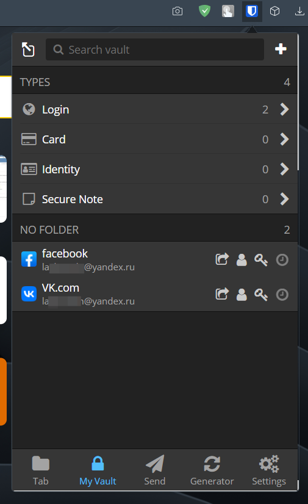
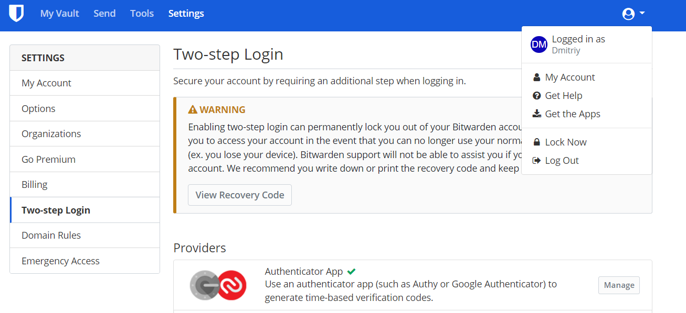
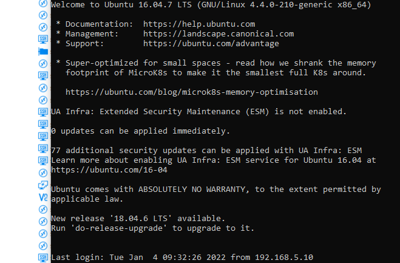
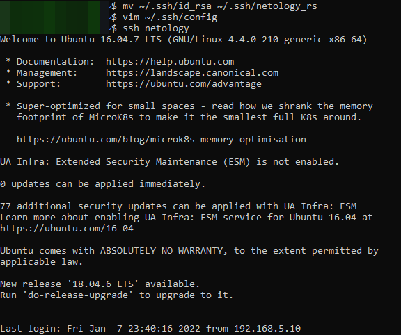
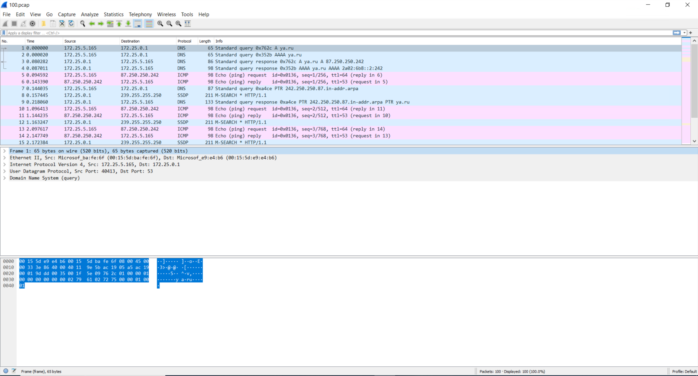

## Установите Bitwarden плагин для браузера. Зарегестрируйтесь и сохраните несколько паролей.

## Установите Google authenticator на мобильный телефон. Настройте вход в Bitwarden акаунт через Google authenticator OTP.

## Установите apache2, сгенерируйте самоподписанный сертификат, настройте тестовый сайт для работы по HTTPS
Устанавливаем apache2:  
sudo apt update && sudo apt install apache2  
Для тестов будем использовать домен dev.netology.com (настроим домен в /etc/hosts)
Генерируем сертификат:  
sudo openssl req -x509 -nodes -days 365 -newkey rsa:2048 -keyout /etc/ssl/private/apache-selfsigned.key -out /etc/ssl/certs/apache-selfsigned.crt  
Подключаем сертификат в apache2  
```
<VirtualHost *:443>
    ServerAdmin your_email@example.com
    ServerName dev.netology.com

    DocumentRoot /var/www/dev.netology.com

    ErrorLog ${APACHE_LOG_DIR}/error.log
    CustomLog ${APACHE_LOG_DIR}/access.log combined

    SSLEngine on

    SSLCertificateFile    /etc/ssl/certs/apache-selfsigned.crt
    SSLCertificateKeyFile /etc/ssl/private/apache-selfsigned.key

</VirtualHost>
```
Проверяем:  
```
vagrant@vagrant:~/testssl.sh$ echo | openssl s_client -showcerts -servername dev.netology.com -connect dev.netology.com:443 2>/dev/null | openssl x509 -inform pem -noout -text
Certificate:
    Data:
        Version: 3 (0x2)
        Serial Number:
            3b:59:a4:e9:b2:f9:16:61:b3:0d:03:3f:6b:2c:8c:cd:7d:25:ad:7e
        Signature Algorithm: sha256WithRSAEncryption
        Issuer: C = RU, ST = Some-State, O = Internet Widgits Pty Ltd, CN = dev.netology.com
        Validity
            Not Before: Jan  7 13:03:43 2022 GMT
            Not After : Jan  7 13:03:43 2023 GMT
        Subject: C = RU, ST = Some-State, O = Internet Widgits Pty Ltd, CN = dev.netology.com
        Subject Public Key Info:
            Public Key Algorithm: rsaEncryption
                RSA Public-Key: (2048 bit)
                Modulus:
                    00:de:76:94:5b:2b:b8:5b:6e:ee:3f:35:93:a4:21:
                    8a:25:f4:c1:08:8b:26:7a:46:6d:73:db:e4:64:10:
                    f8:66:c2:4d:3f:13:a0:28:3b:6a:ce:b4:71:a4:08:
                    a8:12:62:a1:2b:7d:5c:cc:56:1e:10:ab:20:86:d4:
                    93:24:f2:5f:7a:59:04:87:34:85:6c:f5:5c:e6:7d:
                    7a:77:d4:bf:77:ef:fa:61:d4:80:1e:e5:7a:fd:f1:
                    27:f3:57:cd:9f:b9:b3:1a:34:b2:d9:34:cd:ef:2a:
                    3d:04:60:80:e9:c0:9b:6f:7d:95:a1:75:d2:a2:4c:
                    7a:c7:69:b1:56:b7:ab:6f:07:f4:da:2b:e2:46:e9:
                    08:6e:f8:4a:c3:fc:32:3f:2a:e1:25:ae:ff:78:81:
                    25:fa:68:b5:00:b7:80:9c:d9:f9:41:4e:84:f3:e9:
                    9d:59:43:60:42:f5:5b:65:78:2a:85:b8:2c:c2:3a:
                    5f:c9:f6:62:5f:f3:c9:67:6e:7e:c9:30:4a:1e:fd:
                    21:89:5c:89:3d:a3:64:1c:f1:6a:08:b4:8f:94:da:
                    45:cd:2f:d9:da:f3:0d:95:1c:d2:cd:aa:71:04:2c:
                    69:37:d5:b4:53:6f:66:38:be:11:d6:f7:ef:70:a5:
                    be:85:9d:56:7b:27:9d:4d:39:64:49:27:84:c0:9d:
                    a9:53
                Exponent: 65537 (0x10001)
        X509v3 extensions:
            X509v3 Subject Key Identifier:
                D5:75:59:78:74:1F:F7:97:C3:05:47:FD:A2:FD:C7:15:10:1F:2D:82
            X509v3 Authority Key Identifier:
                keyid:D5:75:59:78:74:1F:F7:97:C3:05:47:FD:A2:FD:C7:15:10:1F:2D:82

            X509v3 Basic Constraints: critical
                CA:TRUE
    Signature Algorithm: sha256WithRSAEncryption
         65:55:99:a2:fb:47:c5:5a:0d:1b:42:a4:90:59:fb:87:fb:c1:
         6d:74:55:df:fb:1f:70:e0:ff:74:35:e9:90:43:75:66:e6:09:
         f3:e2:2c:c7:48:32:72:33:68:d5:3d:c2:2b:8c:52:83:f8:d8:
         ca:df:c3:6f:59:04:bb:36:df:e3:f0:9c:11:2c:8b:91:3c:22:
         fb:86:d0:45:1c:58:bc:b8:b4:e5:4e:71:7a:c3:04:fd:eb:2f:
         33:46:3c:fb:18:92:44:b6:a2:c9:33:06:0f:76:ce:6a:e7:a2:
         49:6b:bc:77:c2:09:7e:5c:a0:ec:36:83:96:8c:5a:94:f1:c3:
         b4:25:b3:a7:88:32:99:c4:52:6f:61:47:72:34:34:dc:25:ac:
         0b:c5:04:c8:86:2c:ea:dd:ed:6a:6e:be:e5:07:6f:56:c6:54:
         48:06:f1:46:96:94:0b:67:f4:c6:26:8e:c6:ad:91:c6:53:67:
         a2:b8:1f:6b:41:5d:b6:c2:26:ef:63:ce:bf:9e:a2:1a:22:85:
         34:32:62:35:71:f4:7b:c7:54:c8:b5:da:f6:fd:a8:43:d5:79:
         db:b7:d0:f8:e1:96:38:9c:45:d0:34:80:34:2f:67:7f:df:d2:
         4f:82:7e:73:1c:a2:18:69:c7:3e:2d:0e:f2:62:82:4f:28:58:
         ce:c0:7c:c5
```
## Проверьте на TLS уязвимости произвольный сайт в интернете:
Тестируем сайт https://hitster.fm, используем агрумент -U для проверки на уязвимости
```
vagrant@vagrant:~/testssl.sh$ ./testssl.sh -U --parallel https://hitster.fm

###########################################################
    testssl.sh       3.1dev from https://testssl.sh/dev/
    (4a358e0 2022-01-06 21:17:40 -- )

      This program is free software. Distribution and
             modification under GPLv2 permitted.
      USAGE w/o ANY WARRANTY. USE IT AT YOUR OWN RISK!

       Please file bugs @ https://testssl.sh/bugs/

###########################################################

 Using "OpenSSL 1.0.2-chacha (1.0.2k-dev)" [~183 ciphers]
 on vagrant:./bin/openssl.Linux.x86_64
 (built: "Jan 18 17:12:17 2019", platform: "linux-x86_64")


 Start 2022-01-07 15:14:14        -->> 185.147.80.209:443 (hitster.fm) <<--

 rDNS (185.147.80.209):  hitsterfm.com.
 Service detected:       HTTP


 Testing vulnerabilities

 Heartbleed (CVE-2014-0160)                not vulnerable (OK), timed out
 CCS (CVE-2014-0224)                       not vulnerable (OK)
 Ticketbleed (CVE-2016-9244), experiment.  not vulnerable (OK)
 ROBOT                                     not vulnerable (OK)
 Secure Renegotiation (RFC 5746)           supported (OK)
 Secure Client-Initiated Renegotiation     not vulnerable (OK)
 CRIME, TLS (CVE-2012-4929)                not vulnerable (OK)
 BREACH (CVE-2013-3587)                    potentially NOT ok, "gzip" HTTP compression detected. - only supplied "/" tested
                                           Can be ignored for static pages or if no secrets in the page
 POODLE, SSL (CVE-2014-3566)               not vulnerable (OK)
 TLS_FALLBACK_SCSV (RFC 7507)              Downgrade attack prevention supported (OK)
 SWEET32 (CVE-2016-2183, CVE-2016-6329)    not vulnerable (OK)
 FREAK (CVE-2015-0204)                     not vulnerable (OK)
 DROWN (CVE-2016-0800, CVE-2016-0703)      not vulnerable on this host and port (OK)
                                           make sure you don't use this certificate elsewhere with SSLv2 enabled services
                                           https://censys.io/ipv4?q=A91CC1543D7C85B77256D00340D44BD8A8C4C51E88E9F65D866E692BA8AD8589 could help you to find out
 LOGJAM (CVE-2015-4000), experimental      not vulnerable (OK): no DH EXPORT ciphers, no DH key detected with <= TLS 1.2
 BEAST (CVE-2011-3389)                     TLS1: ECDHE-RSA-AES128-SHA ECDHE-RSA-AES256-SHA AES256-SHA AES128-SHA
                                           VULNERABLE -- but also supports higher protocols  TLSv1.1 TLSv1.2 (likely mitigated)
 LUCKY13 (CVE-2013-0169), experimental     potentially VULNERABLE, uses cipher block chaining (CBC) ciphers with TLS. Check patches
 Winshock (CVE-2014-6321), experimental    not vulnerable (OK) - CAMELLIA or ECDHE_RSA GCM ciphers found
 RC4 (CVE-2013-2566, CVE-2015-2808)        no RC4 ciphers detected (OK)


 Done 2022-01-07 15:15:03 [  50s] -->> 185.147.80.209:443 (hitster.fm) <<--
```
## Установите на Ubuntu ssh сервер, сгенерируйте новый приватный ключ. Скопируйте свой публичный ключ на другой сервер. Подключитесь к серверу по SSH-ключу.
Выполнить на сервере:  
sudo apt install openssh-server  
Выполнить на клиенте:  
ssh-keygen  
ssh-copy-id administrator@server-xx.compnyname.com (имя изменено)  
ssh administrator@server-xx.compnyname.com  
Результат:

## Переименуйте файлы ключей из задания 5. Настройте файл конфигурации SSH клиента, так чтобы вход на удаленный сервер осуществлялся по имени сервера.
Создадим файл ~/.ssh/config со следующим содержимым:  
```
Host netology
    Hostname server-ru.rubius.rubius.com
    Port 22
    User administrator
    identityFile ~/.ssh/netology_rs
```
Выполняем подключение:   

## Соберите дамп трафика утилитой tcpdump в формате pcap, 100 пакетов. Откройте файл pcap в Wireshark
sudo tcpdump -w /home/vagrant/100.pcap -c 100 -i eth0  
Результат откроем в Wireshark:  



## Дополнительное задание
Установите и настройте фаервол ufw на web-сервер из задания 3. Откройте доступ снаружи только к портам 22,80,443  
```
sudo apt install ufw
sudo ufw allow from 123.123.123.123 to any port 22 - (Разрешить подключение по порту 22 для IP адреса 123.123.123.123)
sudo ufw allow from 123.123.123.123 to any port 80 - (Разрешить подключение по порту 80 для IP адреса 123.123.123.123)
sudo ufw allow from 123.123.123.123 to any port 443 - (Разрешить подключение по порту 443 для IP адреса 123.123.123.123)
sudo ufw enable  
```
