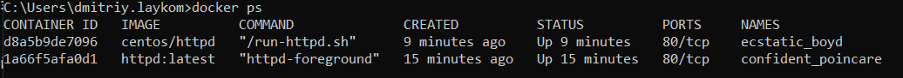

## Task 1
```
docker pull nginx
docker tag wedun/nginx nginx
docker push wedun/nginx
```
Ссылка на репозиторий с изменёммым index.html:  
[link](https://hub.docker.com/r/wedun/nginx)  

## Task 2
```
Описание решений:  
* Высоконагруженное монолитное java веб-приложение - виртуальная машина. Виртуальная машина позволит запускать приложение быстрее чем физическая. Кроме этого даст возможность использовать живую миграцию и создавать снепшоты. Кроме этого можно будет динамически изменять ресурсы доступные приложению (процессор, память). Контейнер не подойдёт из-за высокой нагрузки. Кроме этого приложение монолитное и в контейнеры его упаковать может быть сложно.  
* Nodejs веб-приложение - Docker контейнер. Nodejs приложения хорошо контейнеризируются. За счёт использования контейнеров проще планировать нагрузку и упростит разработку приложения и внедрение. Кроме этого при использовании контейнеров мы получим успрощенное внедрение. Один образ будет собираться на этапе разработки и запускаться в происзводственной среде.  
* Мобильное приложение c версиями для Android и iOS - виртуальная машина. Также для этой задачи подходят Docker контейнеры. Виртуальные машины или контейнеры позволят получить достаточный уровень производительности и масштабируемости. Использование физической машины может быть не оправдано, т.к при малом числе пользвателей оборудование будет простаивать. При большом числе пользователей физическая машина не даст нужного уровня гибкости.  
* Шина данных на базе Apache Kafka - виртуальные машины. Для Apache Kafka нужен достаточный уровень производительности системы и возможность сохранять состояние сервиса. Физическая машина не позволит создвать снепшоты состояния системы. Для задач в которых не требуется хранить состояние apache kafka или не требуется высокая надёжность могут подойти контейнеры.  
* Elasticsearch кластер для реализации логирования продуктивного веб-приложения - три ноды elasticsearch, два logstash и две ноды kibana - виртуальные машины, т.к. необходимо подготовить кластер, который сможет в режиме реального времени обрабатывать логи приложений (statefull приложение). Его лучше разворачивать на ресурсах, способных выдержать необходимую нагрузку.  
* Мониторинг-стек на базе Prometheus и Grafana - Docker контейнеры. Это приложени поддерживают запуск в контейнера. использование контейнеров позволит быстро готовить новые ноды  
* MongoDB, как основное хранилище данных для java-приложения; Виртуальные машины. чтобы использовать надёжную систему, которая позволит записыватьбольшое число событий. Контейнеры могут не подойти из-за несовместимых 
* Gitlab сервер для реализации CI/CD процессов и приватный (закрытый) Docker Registry. - Контейнеры или виртуальные машины. Запуск пайплайнов CI/CD уже адоптированы для запуска в контейнераз.  
```
##  Task 3
Запустите первый контейнер из образа centos c любым тэгом в фоновом режиме, подключив папку /data из текущей рабочей директории на хостовой машине в /data контейнера;
```
docker run -d --privileged=true -v data:/data centos/httpd
docker run -d --privileged=true -v data:/data httpd:latest
```
Проверяем результат:

Создадим файл в первом контейнере:
```
docker exec -it ecstatic_boyd bash
touch /data/container1.txt
```
Создадим файл на хост машине:
```
touch data/host.txt
```
Проверим результат во втором контенере:  
```
root@1a66f5afa0d1:/usr/local/apache2# ls -l /data/
total 0
-rw-r--r--. 1 root root 0 Jun  9 19:35 container1.txt
-rw-rw-r--. 1 root root 0 Jun  9 19:20 host.txt
root@1a66f5afa0d1:/usr/local/apache2#
```
