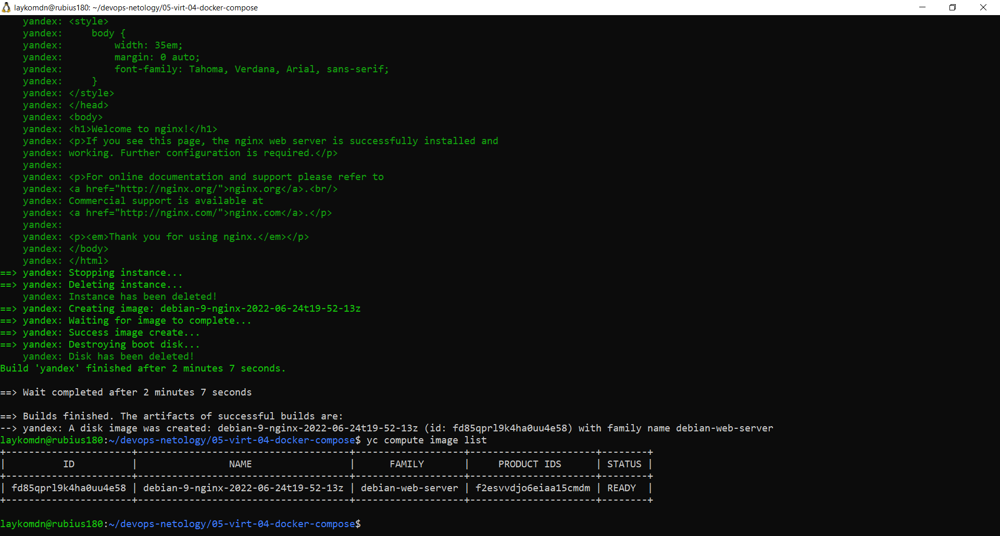
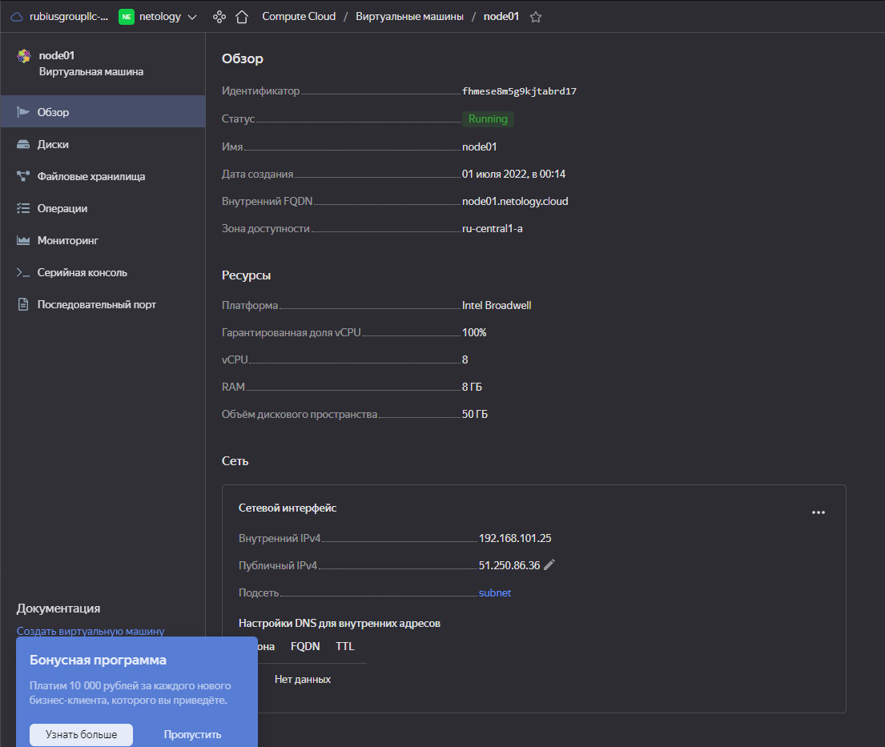
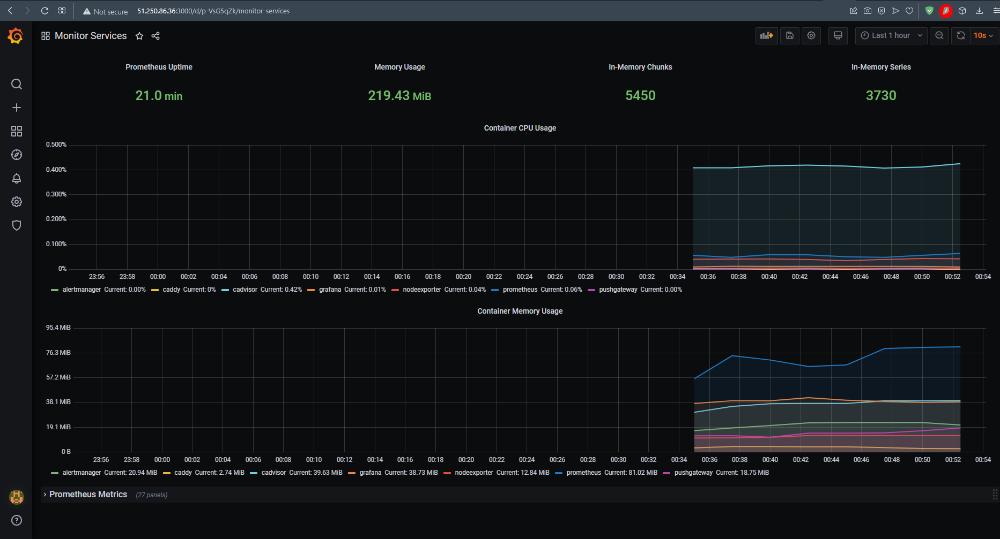

# Создать собственный образ операционной системы с помощью Packer.

# Создать вашу первую виртуальную машину в Яндекс.Облаке.
## Для получения файла key.json выполним команду:  
```
yc iam key create --service-account-name default-sa --output key.json
```
Выполним terraform apply, получим виртуальную машину:  

# Развернём систему мониторинга:  
Скопируем IP адрес из предудущего шага и укажем его в файле inventory
Выполним ansible-playbook provision.yml
Результат работы доступен по адресу: [grafana](https://51.250.86.36:3000)  

