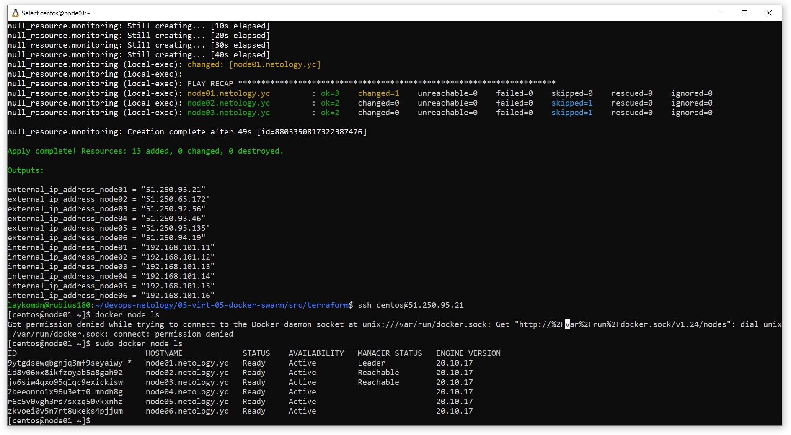
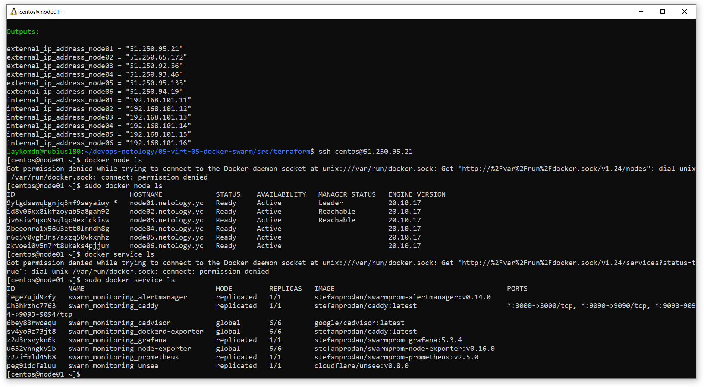

# Задание 1
## Отличие режима работы сервисов replicated и global:
Swarm поддерживает два режима развёртывания сервисов: replicated и global. Они отличаются подходом к развёртыванию сервисов:  
* Replicated: Необходимо заранее указать сколько экземпляров сервисов должно быть запущено в кластере. И swarm будет поддерживать это колличесво. При этом нет необходимости указывать на каких нодах кластера будет запущен сервис. Подходит для stateless приложений.  
* Global: В этом режиме необходимо только указать сервис который должен быть запущен на каждой ноде кластера. Swarm будет запускать по экземпляру сервиса на каждой ноде кластера. Этот режим подходит дял запуска агентов мониторинга или сбора логов.  

## Какой алгоритм выбора лидера используется в Docker Swarm кластере?
в Docker swarm используется при помощи алгоритма Raft. В Docker swarm кластере нода существуют мастер ноды (хранят состояние кластера) и рабочие ноды. Состояние кластера должно быть согласовано и копия состояния должна храниться на каждой мастер ноде. При этом среди мастеров всегда должна сущестовать лидирующая нода. Наличие одинакового согласованного состояния кластера гарантирует, что при возникновении сбоев в том числе вывод из стоя лидирующей ноды, новая лидирующая нода может быть выбрана из существующих мастеров.  
Raft допускает до (N-1)/2 сбоев и требует большинства или кворума из (N/2)+1 членов для согласования значений. Это означает, что в кластере из 5 менеджеров, работающих под управлением Raft, если 3 узла недоступны, система больше не может обрабатывать запросы для планирования дополнительных задач, при этом существующие задачи продолжают выполняться.  

## Что такое Overlay Network?
Overlay network - это тип сети в docker кластерах. Он позволяет создать единую сеть между различными нодами кластера. Контейнеры в этом типе сети находятся в едином адресном пространстве и могут напрямую взаимодействовать друг с другом. Передаваемые данные в Overley сети могут быть зашифрованы, если шифрование включено. 

# Создать ваш первый Docker Swarm кластер в Яндекс.Облаке
```
terraform init
terraform plan
terraform apply --auto-approve 
```
Результат
```
sudo docker node ls
```

```

# Развернуть кластер мониторинга

sudo docker service ls
```


