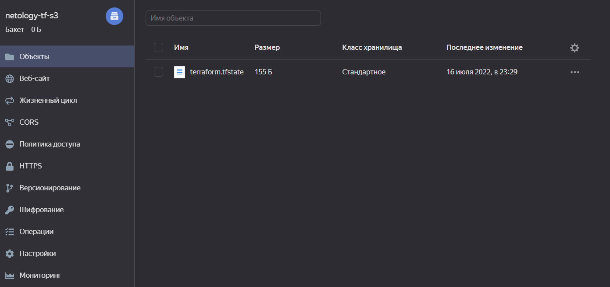

## Задача 1. Создадим бэкэнд в S3 (необязательно, но крайне желательно).
Решаем задачу для Яндекс.Облака
```
yc iam service-account create --name tfservice --description "Netology terraform service"
yc iam access-key create --service-account-name tfservice --description "key for netology tfservice"
```

Зарегистрируйте бэкэнд в терраформ проекте   
```
~/devops-netology/07-terraform-03-basic$ terraform init

Initializing the backend...

Initializing provider plugins...
- Reusing previous version of yandex-cloud/yandex from the dependency lock file
- Using previously-installed yandex-cloud/yandex v0.76.0

Terraform has been successfully initialized!
```
Результат


## Задача 2. Инициализируем проект и создаем воркспейсы.
Файл [main.tf](main.tf)

Вывод команды terraform workspace list  
```
~/devops-netology/07-terraform-03-basic$ terraform workspace list
  default
* prod
  stage
```

Частичный вывод команды terraform plan для воркспейса prod
```

Terraform used the selected providers to generate the following execution
plan. Resource actions are indicated with the following symbols:
...
      + resources {
          + core_fraction = 100
          + cores         = 4
          + memory        = 4
        }

      + scheduling_policy {
          + preemptible = (known after apply)
        }
    }

  # yandex_vpc_network.network-1 will be created
  + resource "yandex_vpc_network" "network-1" {
      + created_at                = (known after apply)
      + default_security_group_id = (known after apply)
      + folder_id                 = (known after apply)
      + id                        = (known after apply)
      + labels                    = (known after apply)
      + name                      = "network1"
      + subnet_ids                = (known after apply)
    }

  # yandex_vpc_subnet.subnet-1 will be created
  + resource "yandex_vpc_subnet" "subnet-1" {
      + created_at     = (known after apply)
      + folder_id      = (known after apply)
      + id             = (known after apply)
      + labels         = (known after apply)
      + name           = "subnet1"
      + network_id     = (known after apply)
      + v4_cidr_blocks = [
          + "192.168.10.0/24",
        ]
      + v6_cidr_blocks = (known after apply)
      + zone           = "ru-central1-a"
    }

Plan: 6 to add, 0 to change, 0 to destroy.

───────────────────────────────────────────────────────────────────────────────────────────────────────────────────────────────────────────────────────────────────────────────────────────────────────────────────────────────────────────────

Note: You didn't use the -out option to save this plan, so Terraform can't guarantee to take exactly these actions if you run "terraform apply" now.
```
