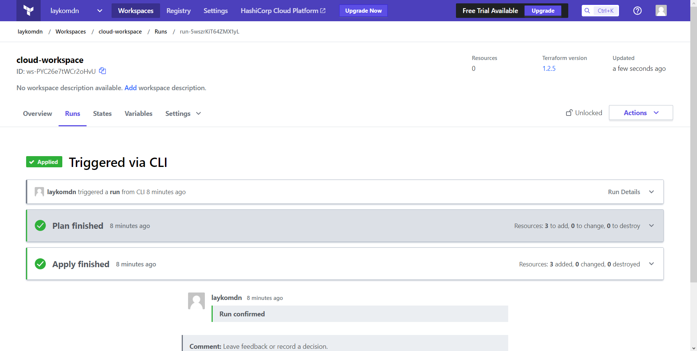
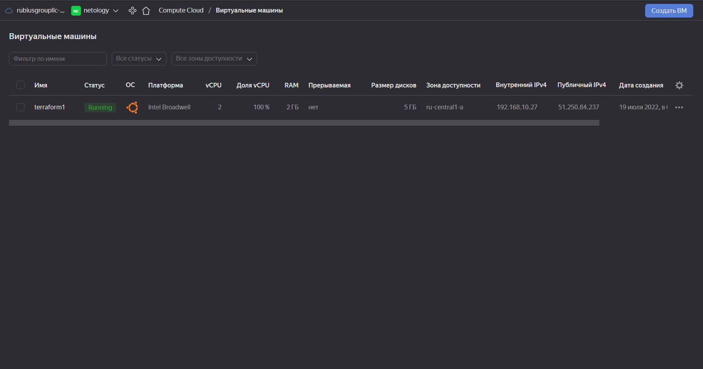

## Задача 1. Настроить terraform cloud (необязательно, но крайне желательно).
```
~/terraform-cloud$ terraform apply
Running apply in Terraform Cloud. Output will stream here. Pressing Ctrl-C
will cancel the remote apply if it's still pending. If the apply started it
will stop streaming the logs, but will not stop the apply running remotely.

Preparing the remote apply...

To view this run in a browser, visit:
https://app.terraform.io/app/laykomdn/cloud-workspace/runs/run-s32JYobcnjsZ2sL2

Waiting for the plan to start...

Terraform v1.2.5
on linux_amd64
Initializing plugins and modules...

No changes. Your infrastructure matches the configuration.

Terraform has compared your real infrastructure against your configuration
and found no differences, so no changes are needed.
```
Результат:



## Задача 2. Написать серверный конфиг для атлантиса.

Создай server.yaml который скажет атлантису:

1. Укажите, что атлантис должен работать только для репозиториев в вашем github (или любом другом) аккаунте.
2. На стороне клиентского конфига разрешите изменять workflow, то есть для каждого репозитория можно будет указать свои дополнительные команды.
3. В workflow используемом по-умолчанию сделайте так, что бы во время планирования не происходил lock состояния.
[server.yaml](server.yaml)
```
repos:
- id: /github.com/wedun/*/
  allowed_overrides: [workflow]
  allow_custom_workflows: true
  
workflows:
  default:
    plan:
      steps:
      - init
      - plan:
          extra_args: ["-lock", "false"]
    apply:
      steps:
      - apply
```
Создай atlantis.yaml который, если поместить в корень terraform проекта, скажет атлантису:
1. Надо запускать планирование и аплай для двух воркспейсов stage и prod.
2. Необходимо включить автопланирование при изменении любых файлов *.tf.
В качестве результата приложите ссылку на файлы server.yaml и atlantis.yaml.
[atlantis.yaml](atlantis.yaml)
```
version: 3
parallel_apply: true
parallel_plan: true
projects:
- name: terraform-cloud
  dir: .
  workspace: stage
  autoplan:
    when_modified: ["../modules/**/*.tf", "*.tf"]
    enabled: true
- name: terraform-cloud
  dir: .
  workspace: prod
  autoplan:
    when_modified: ["../modules/**/*.tf", "*.tf"]
    enabled: true
```

## Задача 3. Знакомство с каталогом модулей
Изучите как устроен модуль. Задумайтесь, будете ли в своем проекте использовать этот модуль или непосредственно ресурс aws_instance без помощи модуля?  
Предыдущее задание выполнял в Яндекс.Облаке, не могу проверить в AWS как работают модули. Могу предположить что использование модуля оправдано в проектах, где активно используются ec2 инстансы.  
В рамках предпоследнего задания был создан ec2 при помощи ресурса aws_instance. Создайте аналогичный инстанс при помощи найденного модуля. (Пример конфигурации)
```
module "ec2_instance" {
  source  = "terraform-aws-modules/ec2-instance/aws"
  version = "~> 3.0"

  name = "single-instance"

  ami                    = "ami-ebd02392"
  instance_type          = "t2.micro"
  key_name               = "user1"
  monitoring             = true
  vpc_security_group_ids = ["sg-12345678"]
  subnet_id              = "subnet-eddcdzz4"

  tags = {
    Terraform   = "true"
    Environment = "dev"
  }
}
```