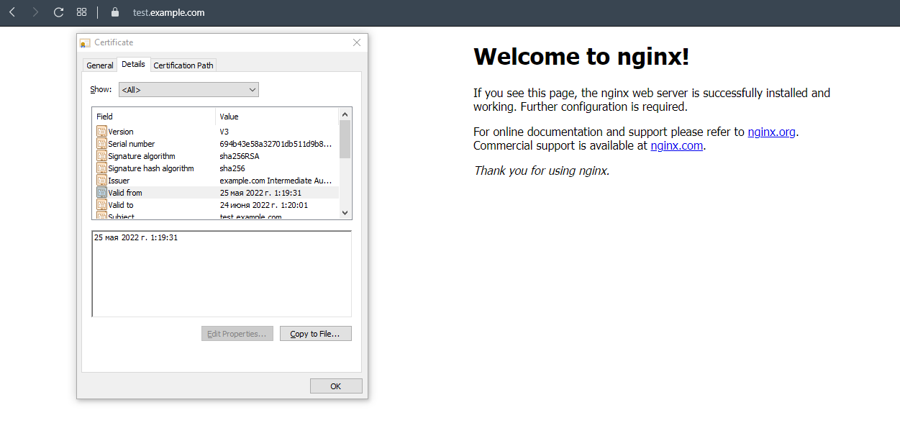

# Создадим виртуальную машину

# Процесс установки и настройки ufw
```
administrator@server-pg-2:~$ sudo ufw allow 22
Rules updated
Rules updated (v6)
administrator@server-pg-2:~$ sudo ufw allow 443
Rules updated
Rules updated (v6)
administrator@server-pg-2:~$ sudo ufw allow in on lo
Rules updated
Rules updated (v6)
administrator@server-pg-2:~$ sudo ufw enable
Command may disrupt existing ssh connections. Proceed with operation (y|n)? y
Firewall is active and enabled on system startup
```
Проверка
```
administrator@server-pg-2:~$ sudo ufw status 
Status: active

To                         Action      From
--                         ------      ----
22                         ALLOW       Anywhere                  
443                        ALLOW       Anywhere                  
Anywhere on lo             ALLOW       Anywhere                  
22 (v6)                    ALLOW       Anywhere (v6)             
443 (v6)                   ALLOW       Anywhere (v6)             
Anywhere (v6) on lo        ALLOW       Anywhere (v6)
```
# Установка и настройка Vault
## Установим Vault
Способ из инструкции не сработал (Репозиторий не подписан). Выполнил установку, скачав gpg ключ. 
```
sudo apt update && sudo apt install gpg
wget -O- https://apt.releases.hashicorp.com/gpg | gpg --dearmor | sudo tee /usr/share/keyrings/hashicorp-archive-keyring.gpg >/dev/null
gpg --no-default-keyring --keyring /usr/share/keyrings/hashicorp-archive-keyring.gpg --fingerprint
curl -fsSL https://apt.releases.hashicorp.com/gpg | sudo apt-key add -
sudo apt-add-repository "deb [arch=$(dpkg --print-architecture)] https://apt.releases.hashicorp.com $(lsb_release -cs) main"
sudo apt update && sudo apt install vault
```
Проверка:
```
administrator@server-pg-2:/etc/apt/sources.list.d$ vault
Usage: vault <command> [args]

Common commands:
    read        Read data and retrieves secrets
    write       Write data, configuration, and secrets
    delete      Delete secrets and configuration
    list        List data or secrets
    login       Authenticate locally
    agent       Start a Vault agent
    server      Start a Vault server
    status      Print seal and HA status
    unwrap      Unwrap a wrapped secret

Other commands:
    audit                Interact with audit devices
    auth                 Interact with auth methods
    debug                Runs the debug command
    kv                   Interact with Vault's Key-Value storage
    lease                Interact with leases
    monitor              Stream log messages from a Vault server
    namespace            Interact with namespaces
    operator             Perform operator-specific tasks
    path-help            Retrieve API help for paths
    plugin               Interact with Vault plugins and catalog
    policy               Interact with policies
    print                Prints runtime configurations
    secrets              Interact with secrets engines
    ssh                  Initiate an SSH session
    token                Interact with tokens
    version-history      Prints the version history of the target Vault server
```
## Выпустим сертификат
```
vault server -dev -dev-root-token-id root
export VAULT_ADDR='http://127.0.0.1:8200'
export VAULT_TOKEN=root
administrator@server-pg-2:~$ vault secrets enable pki               
Success! Enabled the pki secrets engine at: pki/
administrator@server-pg-2:~$ vault secrets tune -max-lease-ttl=87600h pki
Success! Tuned the secrets engine at: pki/
vault write -field=certificate pki/root/generate/internal \
     common_name="example.com" \
     ttl=87600h > CA_cert.crt
administrator@server-pg-2:~$ vault write pki/config/urls \
>      issuing_certificates="$VAULT_ADDR/v1/pki/ca" \
>      crl_distribution_points="$VAULT_ADDR/v1/pki/crl"
Success! Data written to: pki/config/urls
administrator@server-pg-2:~$ vault secrets enable -path=pki_int pki
Success! Enabled the pki secrets engine at: pki_int/
administrator@server-pg-2:~$ vault secrets tune -max-lease-ttl=43800h pki_int
Success! Tuned the secrets engine at: pki_int/
vault write -format=json pki_int/intermediate/generate/internal \
     common_name="example.com Intermediate Authority" \
     | jq -r '.data.csr' > pki_intermediate.csr
vault write -format=json pki/root/sign-intermediate csr=@pki_intermediate.csr \
     format=pem_bundle ttl="43800h" \
     | jq -r '.data.certificate' > intermediate.cert.pem
administrator@server-pg-2:~$ vault write pki_int/intermediate/set-signed certificate=@intermediate.cert.pem
Success! Data written to: pki_int/intermediate/set-signed
dministrator@server-pg-2:~$ vault write pki_int/roles/example-dot-com \
>      allowed_domains="example.com" \
>      allow_subdomains=true \
>      max_ttl="720h"
Success! Data written to: pki_int/roles/example-dot-com
vault write pki_int/issue/example-dot-com common_name="test.example.com" ttl="730h"
Key                 Value
---                 -----
ca_chain            [-----BEGIN CERTIFICATE-----
....
-----END RSA PRIVATE KEY-----
private_key_type    rsa
serial_number       02:d6:3f:53:0b:82:5f:45:04:8e:1b:2b:b1:92:c4:15:a4:bc:7a:db
````

# Установим корневой сертификат созданного центра сертификации в доверенные в хостовой системе
```
sudo cp CA_cert.crt /usr/local/share/ca-certificates/CA_cert.crt
administrator@server-pg-2:~$ sudo update-ca-certificates
Updating certificates in /etc/ssl/certs...
1 added, 0 removed; done.
Running hooks in /etc/ca-certificates/update.d...
done.
```

# Установим Nginx
```
sudo apt update
sudo apt install nginx
administrator@server-pg-2:~$ sudo systemctl status nginx
● nginx.service - A high performance web server and a reverse proxy server
     Loaded: loaded (/lib/systemd/system/nginx.service; enabled; vendor preset: enabled)
     Active: active (running) since Sun 2022-05-15 11:39:00 UTC; 1min 0s ago
       Docs: man:nginx(8)
   Main PID: 7631 (nginx)
      Tasks: 3 (limit: 4540)
     Memory: 7.5M
     CGroup: /system.slice/nginx.service
             ├─7631 nginx: master process /usr/sbin/nginx -g daemon on; master_process on;
             ├─7632 nginx: worker process
             └─7633 nginx: worker process

May 15 11:38:59 server-pg-2 systemd[1]: Starting A high performance web server and a reverse proxy server...
May 15 11:39:00 server-pg-2 systemd[1]: Started A high performance web server and a reverse proxy server.
```

# Настроим nginx на https, используя ранее подготовленный сертификат
## Конфигурационный файл
```
server {
        listen 80;
        server_name test.example.com;
        return 301 https://$host$request_uri;
}
server {
        listen 443 ssl;

        server_name test.example.com;

        root /var/www/html;

        ssl_certificate /certs/website.crt.pem;
        ssl_certificate_key /certs/website.key;

        access_log /var/log/nginx/test.example.com.log;
        error_log /var/log/nginx/error_test.example.com.log;

        location / {
            try_files $uri $uri/ =404;
        }
}
```
## Результат


# Создадим скрипт, который будет генерировать новый сертификат в vault:
```
#!/bin/bash

vault write -format=json pki_int/issue/example-dot-com common_name="test.example.com" ttl="730h" > /certs/website.crt

cat website.crt | jq -r .data.certificate > /certs/website.crt.pem
cat website.crt | jq -r .data.ca_chain[] >> /certs/website.crt.pem
cat website.crt | jq -r .data.private_key > /certs/website.key

nginx -t
systemctl restart nginx.service
```

# Поместим скрипт в crontab и проверим
```
47 23 15 * * /certs/certs.sh
```
